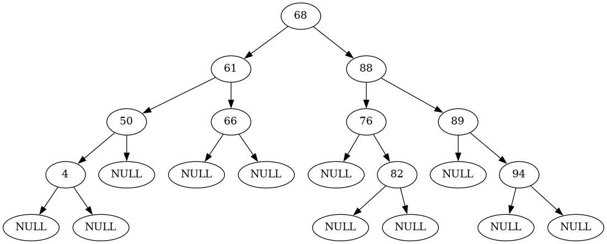

# Chapter 6

- Implemented a pretty much ffeature-complete binary search tree in [bst.py](bst.py)
- Implemented a minimal AVL tree in [avl.py](avl.py)
- Implemented a binary (minimum) heap in [bheap.py](bheap.py)

## Exercises:
1. 
3. 
4. Same as exercise 3 but instead of only being right children, all nodes are left children, with a root of 9
7. 
8. 
## More Exercises?
3. TODO
5. Consider it done
6. TODO
8. TODO, easy
9. TODO, This could be fun
12. TODO