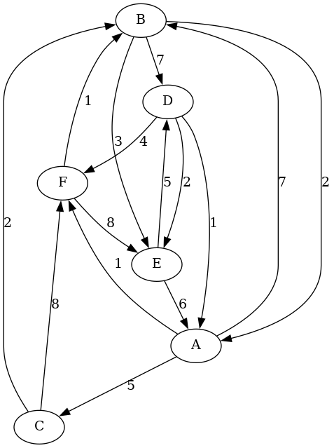
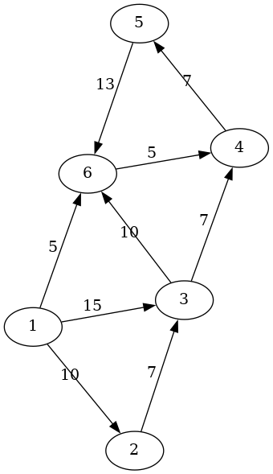

# Chapter 7

- A generic implementation of a graph can be found in [generic_graph.py](generic_graph.py)
- Did a generic word translation thing in [ffoolsage.py](ffoolsage.py)
- Implemented much more efficient Knight's Tour solver with Warnsdorff's rule and bitsets in [ktour.py](ktour.py)
- Implemented a strongly connected components finder in [sccs.py](sccs.py)
- Implemented topological sort in [toposort.py](toposort.py)
- Implemented Dijkstra, of course, in [dijkstraofcourse.py](dijkstraofcourse.py)
- Implemented the algorithms of Kruskal and Prim in [mst.py](mst.py)
- Implemented the Bellman-Ford shortest path finding algorithm in [bellmanford.py](bellmanford.py)
- Implemented the Floyd-Warshall all-pairs distance algorithm in [fwarsh.py](fwarsh.py)
- 
## Exercises
1. 
2. 
The exercises page on runestone.academy seems to be broken...

## TODO:
- ~~Practice doing efficient DFS with proper backtracking (shared list push/pop)~~
    - Used for SCC finding
- ~~Prim's Algorithm~~
- ~~Topological Sort~~
- ~~Bellman-Ford Algorithm~~
    - Nice! good to know
- ~~Floyd-Warshall Algorithm~~
    - Cool!
- ~~Kruskal's Algorithm~~